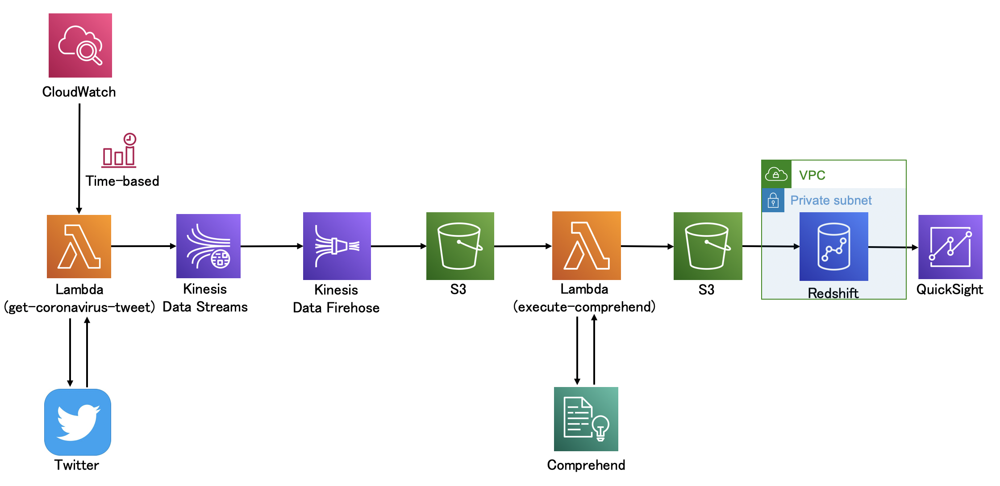

# Twitter検索ツイートを取り込み、分析、可視化するアプリ

## AWS構成(予定)

## 作成状況
- [x] LambdaでAPIをCloudWatchEventsで定期的に実行し、Twitterから検索結果を取得
- [x] Kinesisを経由してS3に配置
- [x] LambdaでComprehendによる感情分析を実行し、結果をS3にcsvファイルを配置
- [ ] Redshift SpectrumでS3のcsvファイルを取り込み
- [ ] QuickSightでデータを可視化